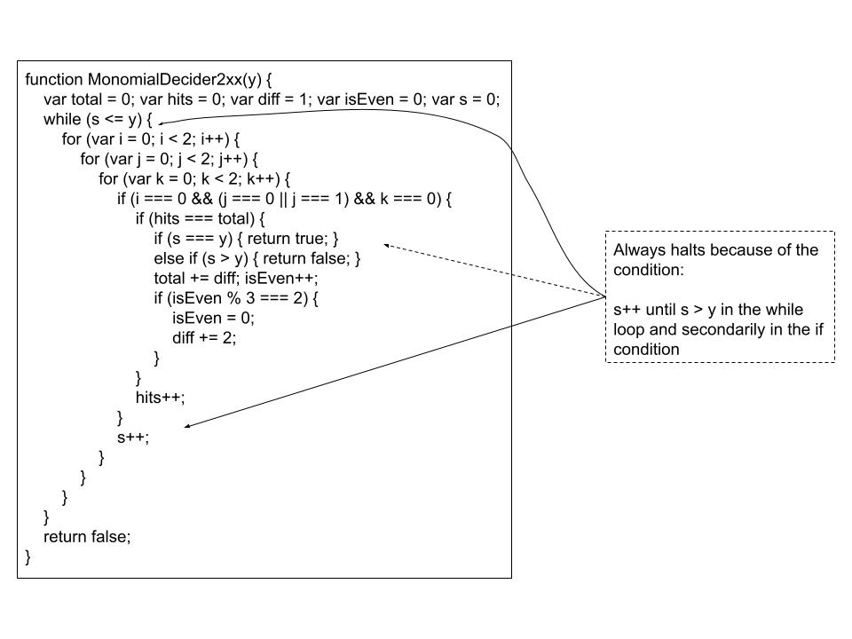
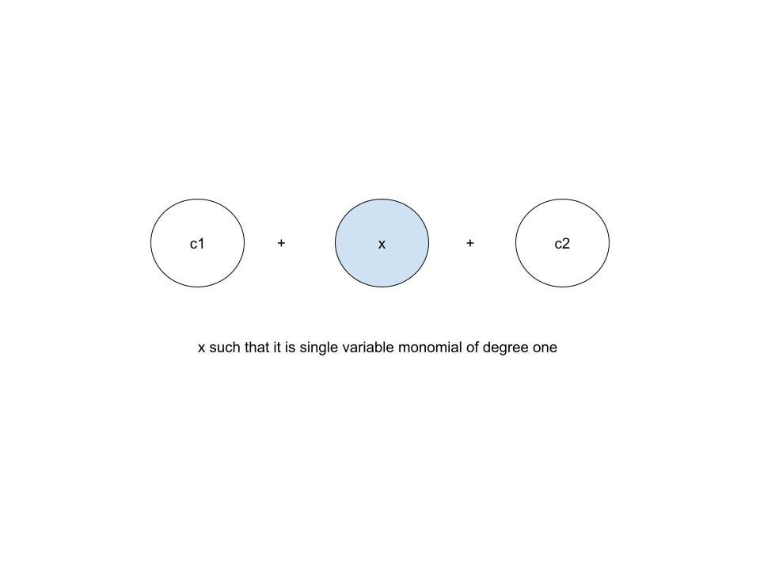

# Topology Of Javascript

### 1. Halting



### 2. Pumping Lemma



``` js
function pumpingLemma(n)
{

	var string = "";

	string += "abcdefg ";
	string += "hello ";

	for (let i = 0; i < n; i++)
	{
		string += "-loop-";
	}

	string += " world";
	string += " hijklmno";

	return string;
}

```
